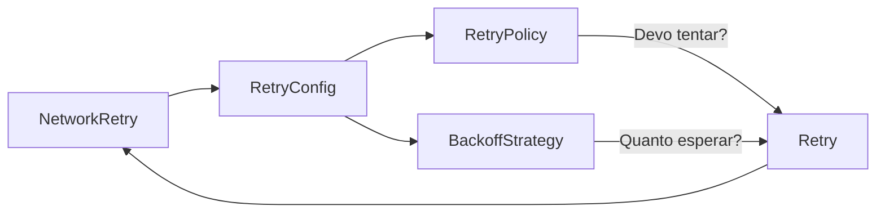

```mermaid
flowchart LR
    A["NetworkRetry"] --> B["RetryConfig"]
    B --> C["RetryPolicy"]
    B --> D["BackoffStrategy"]

    C -->|"Devo tentar?"| E["Retry"]
    D -->|"Quanto esperar?"| E
    E --> A
```
